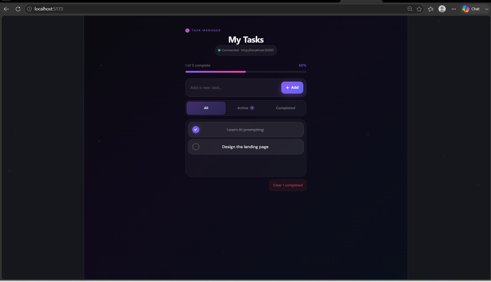
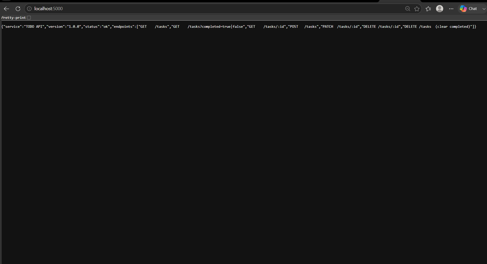

# 🚀 AI-Powered TODO App

A modern full-stack TODO application built using React, Tailwind CSS, Node.js, and Express.js with AI-assisted development workflow.

---

## ✨ Features

* Add new tasks
* Delete tasks
* Mark tasks as completed
* Modern dark UI
* Responsive design
* REST API integration
* Loading and error handling
* Smooth animations

---

## 🛠️ Tech Stack

### Frontend

* React.js
* Tailwind CSS
* Framer Motion
* Vite

### Backend

* Node.js
* Express.js
* CORS
* UUID

---

## 📸 Screenshots

### Frontend Running



### Backend API Running



---


## 📚 Learning Experience

This project helped me learn:

* AI-assisted development
* Prompt engineering
* Full-stack application structure
* CRUD API development
* Frontend and backend integration
* Debugging AI-generated code
* GitHub workflow

---

## ⚙️ Run Locally

### Frontend

```bash
cd frontend
npm install
npm run dev
```

### Backend

```bash
cd backend
npm install
npm run dev
```

---

## 🌐 Local URLs

Frontend:

```bash
http://localhost:5173
```

Backend:

```bash
http://localhost:5000
```


